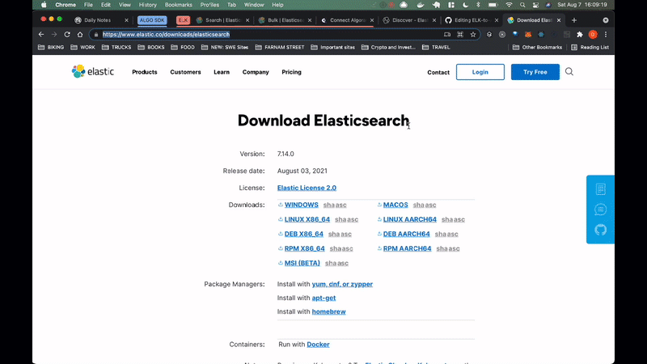
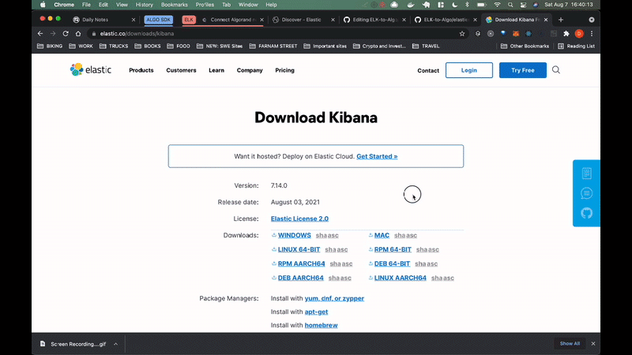

# Connecting Algorand Algod API Data to [Elasticsearch](https://www.elastic.co/elasticsearch/) & [Kibana](https://www.elastic.co/kibana/)

## Prerequeisites: Run an Algorand Node
It is assumed that you are already running an Algorand node, but if you are not you can set one up quickly using [quick-algo](https://github.com/danmurphy1217/algorand-quickstart). Once you are running an Algorand node, you can move onto Step One.

## Step One: Download and install [Elasticsearch](https://www.elastic.co/elasticsearch/)

First, navigate to https://www.elastic.co/downloads/elasticsearch and select which download you would like to install. Since I am working off of a Macbook, I will select MacOS



After your installation completes, navigate to your downloads folder (if that's where you downloaded elasticseach to) and run the following command:

```shell
tar xzvf elasticsearch-7.14.0-darwin-x86_64.tar.gz
```

This will unzip the elasticseaerch files, allowing you to then change into the main elasticsearch directory, configure your clusters and elasticsearch nodes, and run the elasticsearch executable file.

To configure your elasticsearch app, you can change the default settings in `elasticsearch-7.14.0/config/elasticsearch.yml`. For the simplest possible configuration, you can run elasticsearch on http://localhost:9200. The configurations for this will look similar to the following:

```yaml
path.logs: /Users/danielmurphy/Desktop/ELK-to-Algo
network.host: "localhost"
http.port: 9200
```

Now, run:

```shell
./bin/elasticsearch
```

to start elasticsearch. Afterwards, open up a new terminal window and run:

```shell
curl http://localhost:9200/
```

to test the connection and make sure elasticsearch is running as expected.

## Step Two: Download and Install [Kibana](https://www.elastic.co/kibana/)

First, navigate to https://www.elastic.co/downloads/kibana and select which download you would like to install. Since I am working off of a Macbook, I will select MacOS.



After your installation completes, navigate to your downloads folder (if that's where you downloaded elasticseach to) and run the following command:


```shell
tar xzvf kibana-7.13.4-darwin-x86_64.tar.gz
```

This will unzip the kibana files, allowing you to then change into the main kibana directory and configure your preferences for which host and port kibana should run on.

To configure kibana, change the default settings in `kibana-7.13.4-darwin-x86_64/config/kibana.yml`. For the simplest possible configuration, you can run kibana on http://localhost:5601. The configurations for this will look similar to the following:

```shell
server.port: 5601
server.host: "localhost"
```

Now, run:

```shell
./bin/kibana
```

to start kibana. Afterwards, open up a new tab and navigate to `http://localhost:5601/`.

to test the connection and make sure kibana is running as expected.

## Step 3: Connecting data to Elasticsearch & Kibana

At this point, we have elasticsearch and kibana running but do not have any data in elasticsearch to visualize! Now, we will setup a pipline from the Algornad Algod API to Elasticsearch.

In `src/index.js` are four base classes: `APIReader`, `FileReader`, `Parser`, and `Uploader`. They work together to retrieve Algorand data from the `Algod` API, strucutre it for elasticsearch, and upload it to elasticsearch. This process allows for a great amount of customization; you can explicitly state which values you want to extract from the `Algod` API response, map these values to specific data types in elasticsearch, create different index names, upload different endpoint data to different indices, and even read in data from log files (as opposed to using the API). You can use this pipeline tool along with CRON jobs to upload data every N seconds/minutes/etc., which will allow you to build out robust time-series visualiszations in Kibana. Furthermore, the ability to read in log data from your node(s) allows for historical error analysis (along with other more complex analyses).

On a basic level, any `Algorand-to-Elasticsearch` pipeline will follow the following four basic steps:

1. Create an Elasticsearch client:
  ```javascript
  const elasticsearchClient = new Client({
    node: 'http://localhost:9200',
    auth: {
      username: 'elastic',
      password: process.env.ES_PW
    }
  })
  ```
  Note: You'll need to run `EXPORT ES_PW='[MY_ELASTIC_SEARCH_PASSWORD]'` if you follow this template. Otherwise, you can explicitly type out your password. To setup passwords for elasticsearch users, see `elasticsearch-setup-passwords` (https://www.elastic.co/guide/en/elasticsearch/reference/current/setup-passwords.html)

2. Define the mappings for the data you are sending to Elasticsearch. This ensures that Elasticsearch interprets your data as the correct data types. In this example, since I am sending the signature (`sig`), fee (`fee`), note (`note`), sender (`snd`), type (`type`), date (`date`), and ID (`id`) fields to Elasticsearch, I need to explicity define what data types they are:
  ```javascript
  let mappings = {
    sig: {
      type: "text"
    },
    fee: {
      type: "integer"
    },
    note: {
      type: "text"
    },
    snd: {
      type: "text"
    },
    type: {
      type: "text"
    },
    date: {
      type: "date"
    },
    id: {
      type: "text"
    }
  }
  ```

3. Create an `APIReader` or `FileReader` object. If using the `APIReader`, you need to pass the endpoint of the API to ping along with any necessary headers, the body of the request, and params. If using the `FileReader`, you need to pass the path to the log file. For both of these reader objects, you can additionally pass an array of values for `keysToFetch`. This is used to tell the `Parser` object which keys to extract from the root level of the data returned from the API request or File line. If you do not pass an Array to `keysToFetch`, we automatically extract all root-level keys.
  ```javascript
  // api reader
  const apiReader = new APIReader({url: "http://127.0.0.1:8080/v2/transactions/pending"}, {
    headers: {
      "X-Algo-API-Token": process.env.TOKEN
    }
  })

  // file reader
  const fileReader = new FileReader("/Users/danielmurphy/Desktop/ELK-to-Algo/test.log")
  ```
  Note: You can retrieve your Algorand API Token in the `algod.token` of the `data` folder where you are running your Algorand node. If you are using a third-party service to run your node, they should supply you with an API token.

4. Lastly, you can run your script and upload data to Elasticsearch:
  ```javascript
  async function run(reader) {
    let parser = await reader.read(); // returns a parser object
    let uploader = await parser.structure(); // returns an uploader object
    console.log(uploader);

    await uploader.uploadTo(elasticsearchClient, {
      mappings: mappings, // mappings for the index
      indexName: "algorand-final" // name of the index
    })
  }

  run(apiReader).catch(console.log)
  run(fReader).catch(console.log)
  ```

## Automating this process
These steps take a bit to complete, and in an effort to make it as frictionless as possible for you to get up and running with elasticsearch and kibana, I setup several `Make` commands that extrapolate some of the complexities and perform many of the necessary commands for you. In this section, we will discuss these `Make` commands:

1. To download elasticsearch and kibana and set up the basic configurations for them, run `Make download`. This retrieves their zipped files from https://elastic.co, unzips them, and adds the basic configurations for the elasticsearch and kibana nodes in their respective `config` folders.
2. To run kibana, use `Make run_kibana`. This spins up the kibana server and allows you to navigate to http://localhost:5601 to view your dashboards.
3. To run elasticsearch, use `Make run_elasticsearch`. This spinds up the elasticseach server and allows you to begin storing data in elasticsearch.
4. To populate elasticsearch, run `Make populate` with the appropriate arguments. If you want to send file-based data to elasticsearch, the command should look like this: `Make populate type='--file' path_or_url='[file_path]' mappings='{msg: "place mappings for each value here"}'`. If you want to send API-based data to elasticsearch, the command should look like this: `Make populate type='--url' path_or_url='[url_path]' mappings='{msg: "place mappings for each value here"}'`. Mappings should look similar to the following (with the keys and values for the types replaced with the mapping for your data): `{arcv: {type: "text"}, sig: {type: "text"}, fee: { type: "integer"}`. Each variable should have a specified type. Successfully running `Make populate` with send data to elasticsearch and allow you to begin building complex visualizations in kibana.
5. To clean up the elasticsearch and kibana files and start from scratch, run `Make clean`.

Lastly, to import the pre-configured dashboard into Kibana, follow these steps:
1. Navigate to http://localhost:5601/app/home#/
2. Open the Menu on the left side of the screen and click 'Stack Management'
2. Click 'Saved Objects'
3. Click 'Import' and import the `.ndjson` stored in the root of this github repository.

If you have questions about this process, please refer to [this video demo](https://share.getcloudapp.com/2nulxnzv)
